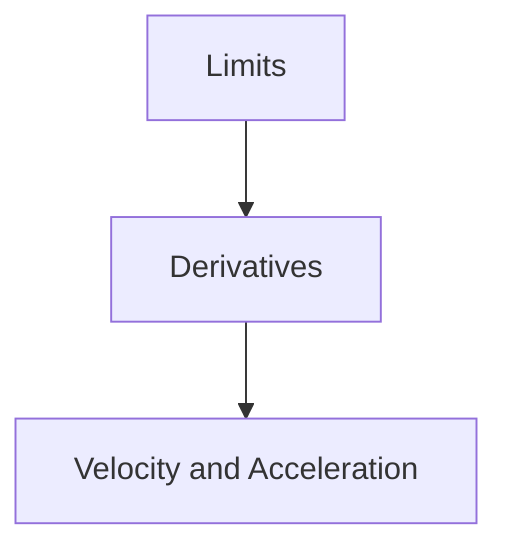

# Gravitational-Wave Research Knowledge Graph

## Calculus and Mechanics

## How to read this graph

An arrow from one concept to another indicates that understanding the first concept supports learning the second.
  
